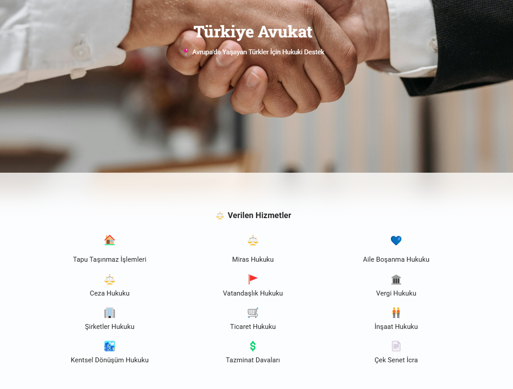
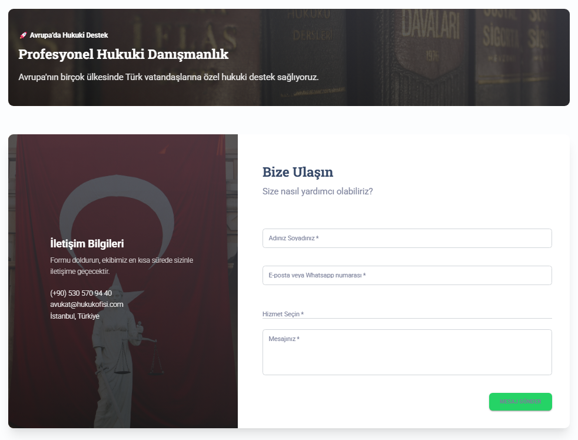

Türkiye Avukat – Legal Support Platform 🇹🇷⚖️
Türkiye Avukat is a professional legal consultancy website built to support Turkish citizens living in Europe. The platform offers a clean, responsive user interface, an overview of legal services, and an easy way to get in touch via WhatsApp or the contact form.

This project is built with React.js and styled using Material UI (Material Kit 2 React).

🌟 Features
🇪🇺 Legal support tailored for Turkish citizens residing in Europe

📋 A visual list of legal services with clear icons

💬 Direct WhatsApp integration for fast communication

📞 Contact form to request legal help

🧭 Transparent layout with accessible information

📱 Fully responsive design for mobile and desktop

🛠️ Technologies Used
React.js

Material UI (MUI) & Material Kit 2

JavaScript (ES6+)

Responsive Design

📸 Screenshots
### Homepage View

### Services & Contact Section

📬 Contact
📱 WhatsApp: +90 530 570 94 40
📧 Email: avukat@hukukofisi.com
📍 Location: Istanbul, Turkey

